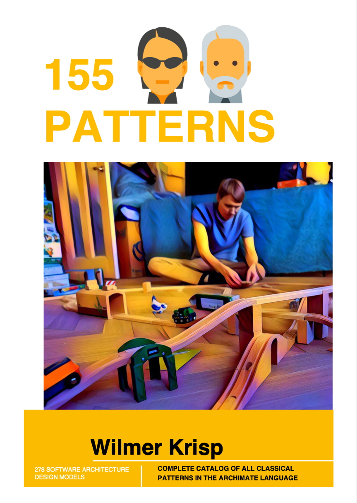

= patterns
Complete catalog of all classical patterns in the Archimate language (ArchiTool used https://www.archimatetool.com)
This version includes all 155+ patterns completed (278+ models). Images also available.

- Domain driven design patterns
- Fowler's Analysis patterns
- Fowler's Enterprise patterns
- GoF classical Design patterns
- Uncle Bob, Robert Martins patterns

It's great opportunity to use best practices in your micro service architecture
Also avialable at http://arch.expert.life/en/patterns

== See huge examples inside book

image:example1.png[link="example1.png"]
image:example2.png[link="example2.png"]

== Book avialable also with pdf

== Architecture with JArchitect
image:https://www.jarchitect.com/assets/img/transparentlogo.png["JArchitecture",width=170,link="http://www.jarchitect.com"]
Architecture diagrams is also presented for comparison (coming soon!), built with JArchitect. Thanks to Codegears / CppDepend for the JArchitect.

== Architecture with Structure101
image:http://structure101.com/images/s101_170.png["Structure101",width=170,link="http://www.Structure101.com"]
Architecture diagrams is also presented for comparison, built with Structure101 Studio. Thanks to Structure101 for the Studio/Workspace.

== Table of contents

* DESIGN PATTERNS
** CREATIONAL PATTERNS
*** ABSTRACT FACTORY
*** BUILDER
*** FACTORY METHOD
*** PROTOTYPE
*** SINGLETON
** STRUCTURAL PATTERNS
*** ADAPTER OF CLASS
*** ADAPTER OF OBJECT
*** BRIDGE
*** COMPOSITE
*** DECORATOR
*** FACADE
*** FLYWEIGHT
*** FLYWEIGHT + COMPOSITE
*** PROXY
** BEHAVIORAL PATTERNS
*** CHAIN OF RESPONSIBILITY
*** COMMAND
*** INTERPRETER
*** ITERATOR
*** MEDIATOR
*** MEMENTO
*** OBSERVER
*** STATE
*** STRATEGY
*** TEMPLATE METHOD
*** VISITOR
* ENTERPRISE PATTERNS
** BUSINESS LOGIC
*** DOMAIN MODEL
*** SERVICE LAYER
*** TRANSACTION SCRIPT
*** TABLE MODULE
** DATA SOURCES
*** ACTIVE RECORD
*** DATA MAPPER
*** ROW DATA GATEWAY
*** TABLE DATA GATEWAY
** MODELING BEHAVIOR
*** IDENTITY MAP
*** LAZY LOAD
*** UNIT OF WORK
** MODELING STRUCTURE HIERARCHY
*** CLASS TABLE INHERITANCE
*** CONCRETE TABLE INHERITANCE
*** INHERITANCE MAPPERS
*** SINGLE TABLE INHERITANCE
** MODELING STRUCTURE RELATIONS
*** ASSOCIATION TABLE MAPPING
*** DEPENDENT MAPPING
*** EMBEDDED VALUE
*** FOREIGN KEY MAPPING
*** IDENTITY FIELD
*** SERIALIZED LOB
** METADATA
*** METADATA MAPPING
*** QUERY OBJECT
*** REPOSITORY
** WEB REPRESENTATION CONTROLLER
*** MODEL VIEW CONTROLLER
*** APPLICATION CONTROLLER
*** FRONT CONTROLLER
*** PAGE CONTROLLER
** WEB REPRESENTATION VIEW
*** TEMPLATE VIEW
*** TRANSFORM VIEW
*** TWO STEP VIEW
** DISTRIBUTED PROCESSING
*** DATA TRANSFER OBJECT
*** REMOTE FAÇADE
** PARALLEL PROCESSING
*** COARSE-GRAINED LOCK
*** IMPLICIT LOCK
*** OPTIMISTIC OFFLINE LOCK
*** PESSIMISTIC OFFLINE LOCK
** SESSION STATE
*** CLIENT SESSION STATE
*** DATABASE SESSION STATE
*** SERVER SESSION STATE
** COMMON PATTERNS
*** GATEWAY
*** LAYER SUPERTYPE
*** MAPPER
*** MONEY
*** PLUGIN
*** RECORD SET
*** REGISTRY
*** SEPARATED INTERFACE
*** SERVICE STUB
*** SPECIAL CASE
*** VALUE OBJECT
* ANALYSIS PATTERNS
** ACCOUNTABILITY
*** PARTY
*** ACCOUNTABILITY
*** ORGANIZATION HIERARCHIES
*** ORGANIZATION STRUCTURE
*** ACCOUNTABILITY KNOWLEDGE LEVEL
*** PARTY TYPE GENERALIZATIONS
*** HIERARCHIC ACCOUNTABILITY
*** OPERATING SCOPES
*** POST
** OBSERVATIONS AND MEASUREMENTS
*** QUANTITY
*** CONVERSION RATIO
*** OBSERVATIONS AND MEASUREMENTS
*** COMPOUND UNITS
*** MEASUREMENT
*** OBSERVATION
*** SUBTYPING OBSERVATION CONCEPTS
*** PROTOCOL
*** DUAL TIME RECORD
*** REJECTED OBSERVATION
*** ACTIVE OBSERVATION, HYPOTHESIS, AND PROJECTION
*** ASSOCIATED OBSERVATION
*** PROCESS OF OBSERVATION
** OBSERVATIONS FOR CORPORATE FINANCE
*** ENTERPRISE SEGMENT
*** MEASUREMENT PROTOCOL
*** RANGE
*** OBSERVATIONS FOR CORPORATE FINANCE
*** PHENOMENON WITH RANGE
*** REFERRING TO OBJECTS
*** NAME
*** IDENTIFICATION SCHEME
*** OBJECT MERGE
*** OBJECT EQUIVALENCE
** REFERRING TO OBJECTS
*** INVENTORY AND ACCOUNTING
*** ACCOUNT
*** TRANSACTIONS
*** SUMMARY ACCOUNT
*** MEMO ACCOUNT
*** POSTING RULES
** INVENTORY AND ACCOUNTING
*** INDIVIDUAL INSTANCE METHOD
*** POSTING RULE EXECUTION
*** POSTING RULES FOR MANY ACCOUNTS
*** CHOOSING ENTRIES
*** ACCOUNTING PRACTICE
*** SOURCES OF AN ENTRY
*** BALANCE SHEET AND INCOME STATEMENT
*** CORRESPONDING ACCOUNT
*** SPECIALIZED ACCOUNT MODEL (BILLING EXAMPLE)
*** SPECIALIZED ACCOUNT MODEL (INVENTORY EXAMPLE)
*** BOOKING ENTRIES TO MULTIPLE ACCOUNTS
** PLANNING
*** PROPOSED AND IMPLEMENTED ACTION
*** COMPLETED AND ABANDONED ACTIONS
*** SUSPENSION
*** PLAN
*** PROTOCOL
*** RESOURCE ALLOCATION
*** PLANNING
*** PLANNING (NO OUTCOME)
*** OUTCOME AND START FUNCTIONS
** TRADING
*** CONTRACT
*** PORTFOLIO
*** QUOTE
*** SCENARIO
*** TRADING
** DERIVATIVE CONTRACTS
*** FORWARD CONTRACTS
*** OPTIONS
*** PRODUCT
*** SUBTYPE STATE MACHINES
*** PARALLEL APPLICATION AND DOMAIN HIERARCHIES
*** DERIVATIVE CONTRACTS
** TRADING PACKAGES
*** MULTIPLE ACCESS LEVELS TO A PACKAGE
*** MUTUAL VISIBILITY
*** TRADING PACKAGES
** LAYERED ARCHITECTURE FOR INFORMATION SYSTEMS
*** TWO-TIER ARCHITECTURE
*** THREE-TIER ARCHITECTURE
*** PRESENTATION AND APPLICATION LOGIC
*** DATABASE INTERACTION
** TYPE MODEL DESIGN
*** IMPLEMENTING ASSOCIATIONS
*** IMPLEMENTING GENERALIZATION
*** OBJECT CREATION
*** OBJECT DESTRUCTION
*** ENTRY POINT.
*** IMPLEMENTING CONSTRAINTS
* DOMAIN DRIVEN DESIGN
** MODEL AND STRUCTURAL ELEMENTS
*** MODEL-DRIVEN DESIGN
*** LAYERED ARCHITECTURE (ASYMMETRIC )
*** HEXAGONAL ARCHITECTURE (SYMMETRIC)
*** COMPOSITE UI
*** ENTITIES
*** VALUE-OBJECTS
*** DOMAIN SERVICES
*** MODULES
*** AGGREGATES
*** AGGREGATE ROOT
*** BEHAVIOR‐FOCUSED AGGREGATE ROOT
*** MODIFY AND COMMIT ONLY ONE AGGREGATE INSTANCE IN ONE TRANSACTION
*** PROTECT BUSINESS INVARIANTS INSIDE AGGREGATE BOUNDARIES
*** REFERENCE OTHER AGGREGATES BY IDENTITY ONLY
*** FACTORIES
*** REPOSITORIES
** SUPPLE DESIGN
*** UBIQUITOUS LANGUAGE
*** INTENTION-REVEALING INTERFACES
*** SIDE-EFFECT FREE FUNCTIONS
*** ASSERTIONS
*** CONCEPTUAL CONTOURS
*** STANDALONE CLASSES
*** CLOSURE OF OPERATIONS
** MODEL INTEGRITY AND CONTEXT
*** BOUNDED CONTEXT
*** CONTINUOUS INTEGRATION
*** STRATEGIC CONTEXT MAP
*** CONTEXTUAL MAP
*** SHARED KERNEL
*** CUSTOMER-SUPPLIER TEAMS
*** CONFORMIST
*** ANTICORRUPTION LAYER
*** SEPARATE WAYS
*** OPEN HOST SERVICE
*** PUBLISHED LANGUAGE
** DISTILLATION
*** CORE DOMAIN
*** GENERIC SUBDOMAINS
*** DOMAIN VISION STATEMENT
*** HIGHLIGHTED CORE
*** COHESIVE MECHANISMS
*** SEGREGATED CORE
*** ABSTRACT CORE
** LARGE-SCALE STRUCTURE
*** EVOLVING ORDER
*** SYSTEM METAPHOR
*** RESPONSIBILITY LAYERS
*** KNOWLEDGE LEVEL
*** PLUGGABLE COMPONENT FRAMEWORK
** ADDITIONAL PATTERNS
*** TYPES OF CONSISTENCY
*** EVENT SOURCING
*** EVENT PROCESSOR
*** EVENT DISPATCHER
*** INTERNAL DOMAIN EVENTS
*** EXTERNAL DOMAIN EVENTS, TRANSFER BETWEEN CONTEXTS
*** STATIC DOMAIN EVENTS CLASS
*** ONE SUBDOMAIN PER BOUNDED CONTEXT
*** THE APPLICATION LAYER COORDINATES THE WORK BETWEEN CONTEXTS
*** THE SAME PHYSICAL ENTITY IN DIFFERENT CONTEXTS
*** INTEGRATION OF BOUDED CONTEXTS THROUGH DATABASE
*** INTEGRATION OF BOUDED CONTEXTS THROUGH FLAT FILES
*** INTEGRATION OF BOUDED CONTEXTS THROUGH ENTERPRISE SERVICE BUS
*** INTEGRATION OF BOUDED CONTEXTS THROUGH MESSAGE QUEUE
*** DEPENDENCY INJECTION
*** DEPENDENCY INVERSION
*** INVERSION OF CONTROL
*** SERVICE LOCATOR
*** CQRS
*** CQS
*** WRAP LOW-LEVEL EXCEPTIONS
*** EXTRACT DEPENDENCY FROM INTERFACE TO COSNTRUCTOR
*** INTERFACE SEGREGATION
** CLEAN ARCHITECTURE
