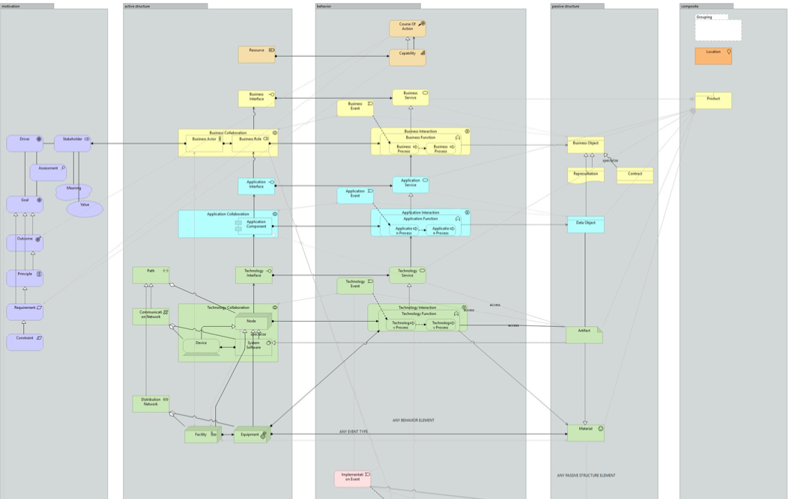
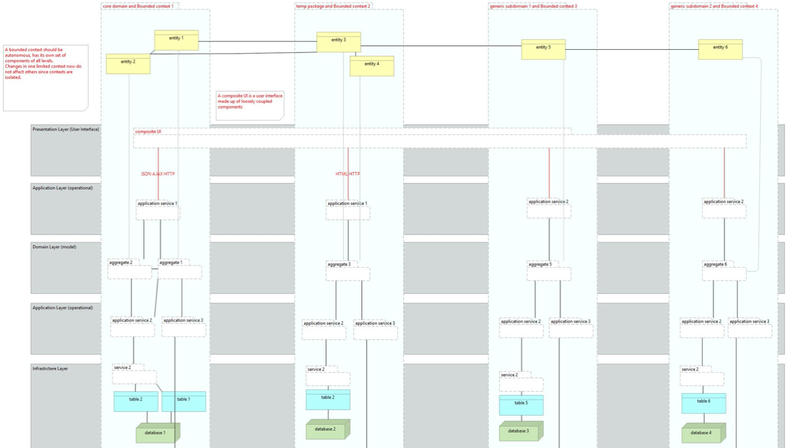

= patterns
Complete catalog of all classical patterns in the Archimate language (ArchiTool used https://www.archimatetool.com)
This version includes all 155+ patterns completed (278+ models). Images also available.

- Domain driven design patterns
- Fowler's Analysis patterns
- Fowler's Enterprise patterns
- GoF classical Design patterns
- Uncle Bob, Robert Martins patterns

It's great opportunity to use best practices in your micro service architecture
Also avialable at http://arch.expert.life/en/patterns

== See huge examples inside book

== Book avialable also with pdf
patterns.pdf

== Architecture with JArchitect
image:https://www.jarchitect.com/assets/img/transparentlogo.png["JArchitecture",width=170,link="www.jarchitect.com"]
Architecture diagrams is also presented for comparison (coming soon!), built with JArchitect. Thanks to Codegear / CppDepend for the JArchitect.

